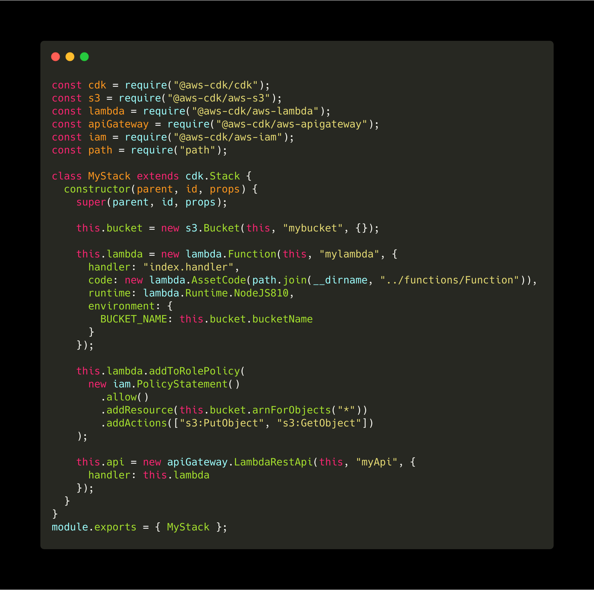
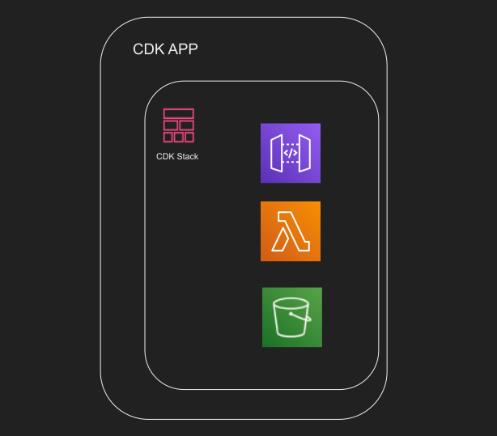

import { Image, Head, Appear } from "mdx-deck";
import { Split, FullScreenCode } from "mdx-deck/layouts";
// import { CodeSurfer } from "mdx-deck-code-surfer";
export { dark as theme } from "mdx-deck/themes";
import theme from "./theme";
import titleLayout from "./title_layout";
import Layout from "./layout";
import BGLayout from "./bglayout";
import BGImage from "./BGImage";
import ts from "./images/ts.png";
import java from "./images/java.jpg";
import net from "./images/net.png";
import python from "./images/python.jpg";
import js from "./images/js.png";
import legacy from "./images/legacy.png";
import cert from "./images/cert.png";
import myStack from "./images/myStack.png";
import myStackarc from "./images/myStackarc.png";
import heaven from "./images/heavenb1.jpg";
import thanks from "./images/thanks.gif";
import bash from "./images/bash.png";
import angry from "./images/angry.gif";

@TODO: DA logo

<Head>
  <title>ServerlessDays</title>
</Head>

# Code Your Infrastructure With Your Favorite Language!

export default titleLayout;

---

# Why Infrastructure as Code?

export default Layout;

<ul>
  <Appear>
    <p>Avoid Manual Resources Creation</p>
    <p>Deployment Environments</p>
    <p>Reusability and Scalability</p>
    <p>Versioning/git</p>
  </Appear>
</ul>

```notes
- what is Infrastructure
- infra as code is underrated
- time consuming so developers do it manually
- benefits
- we use reusability for our products
- we use git

```

---

export default Layout;

## AWS CloudFormation

## Terraform

## Serverless Framework

## AWS SAM

## AWS Amplify-CLI

```notes
- we as DA in Iac

```

---

# AWS CloudFormation

export default Layout;

---

<Image src={"./images/cfn.svg"} />

```notes
- our experience with cfn

EASY TO AUTOMATE
REPRODUCIBLE
CONFIGURATION SYNTAX
NO ABSTRACTION, LOTS OF DETAILS
ALWAYS HAVE CFN TAB OPEN

```

---

A cloudFormation stack containing a Bucket, a Lambda and an API

<Image src="./images/cfn-yaml.svg" />

```notes
- our frustration
```

---


---

export default BGLayout;

# CDK

### Cloud Development Kit

<BGImage src={heaven} />

---

export default Layout;

## Open Source

## Almost one year

## Beta v0.34.0

---

export default Layout;

<div   style={{display: "grid", gridTemplateColumns:"20% 20% 20% 20% 20%", gridTemplateRows:"100%", gridColumnGap: "20px"}}>


</div>

---


---

export default Layout;

# Constructs

```notes
- Represent all the resources available on AWS
- It contains low-level and high-level classes
- Low-level resources are generated from AWS CloudFormation resources type reference (The ones starting with ‘cfn’)
- High-level resources offer same functionality but much less detail required
- They offer smart defaults and defined automatic configuration
```

```jsx
new s3.Bucket(this, "MyBucket");
```

---

### CDK Command Line Interface


---

export default Split;



#### about 320 lines as yaml file



---

### Challenging Example: Http Certificate Provisioning

export default Layout;


```notes
- we did this and said we share it

```

---

export default Layout;

# Infrastructure as REAL code!

<ul>
  <Appear>
    <p> Multi Region </p>
    <p> Best Practices</p>
    <p> Code Completion </p>
    <p> Code Reusability </p>
    <p> Private Constructs</p>
    <p>
      <font style={{ color: "red" }}> Not easy at first glance </font>
    </p>
  </Appear>
</ul>

---

export default Layout;

### Can we use our existing Yaml/Json files?


---


<p><font color="#00ACEE">@farminfarzin</font></p>

#### https://digitalattitude.com

#### https://code-your-infrastructure-with-your-favorite-language.now.sh

---

```notes
cdk versions check
cdk commands
number of lines lines as yaml
test and debug


first present my self and usage of cdk in da, how was the experience
```
