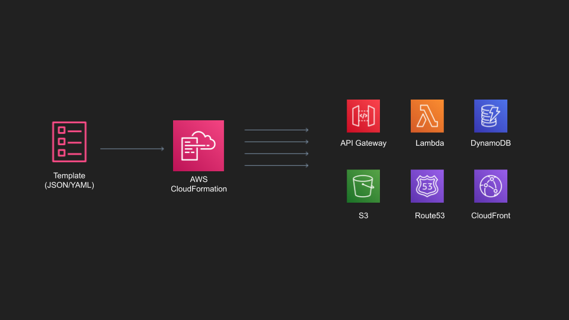

import { Appear } from "mdx-deck";
import { Split, FullScreenCode } from "mdx-deck/layouts";
import { CodeSurfer } from "mdx-deck-code-surfer";
import code from "!raw-loader!./code.js";
export { dark as theme } from "mdx-deck/themes";
import theme from "./theme";
import nightOwl from "prism-react-renderer/themes/nightOwl";
import titleLayout from "./title_layout";
import Layout from "./layout";

# Code Your Infrastructure With Your Favorite Language!

export default titleLayout;

---

### High numbers of resource creation requests

### Cloud Environment

### Deployment Environments

### Reusability and Scalability

### Versioning

---

# So if I need to do it one time, ten times, or a thousand times, can I automate that?

---

# CloudFormation

---



---

## cloudformation template example

---

# a gif

---

# CDK

### Cloud Development Kit

---

# image of cdk architecture

---

## cfn and construct

---

# Cons

---

# very short example of a construct and its equivalent yaml

---

# Code review

---

# SAM and Amplify

---

# pipeline and development chain

---

# Slide Note

```notes
Only visible in presenter mode
```

---

# Appear Example

<ul>
  <Appear>
    <li>One</li>
    <li>Two</li>
    <li>Three</li>
  </Appear>
</ul>

---

export default Split;


# Arizona

---

export default FullScreenCode;

```jsx
const path = require("path");

const apiGateway = require("@aws-cdk/aws-apigateway");
const cdk = require("@aws-cdk/cdk");
const iam = require("@aws-cdk/aws-iam");
```

---

<CodeSurfer
  title="Some Title"
  code={code}
  lang="javascript"
  showNumbers={false}
  dark={false}
  steps={[
    { notes: "Start with this note" },
    { lines: [6], notes: "Note for the first step" },
    { range: [5, 9] },
    { tokens: { 9: [3, 4, 5] }, notes: "Note for the third step" }
  ]}
/>
