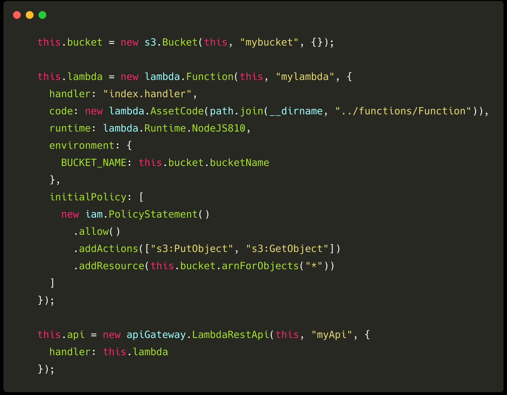
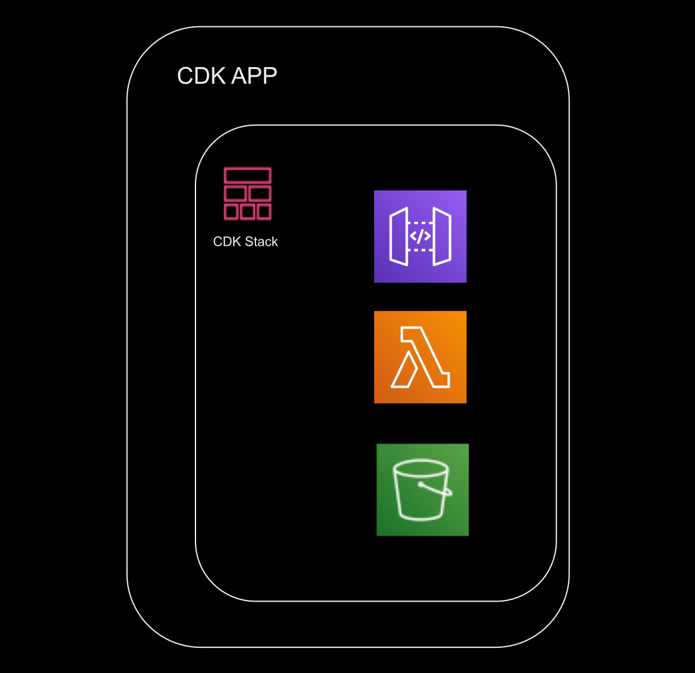

import { Image, Head, Appear } from "mdx-deck";
import { Split, FullScreenCode } from "mdx-deck/layouts";
// import { CodeSurfer } from "mdx-deck-code-surfer";
import code from "!raw-loader!./code.js";
export { dark as theme } from "mdx-deck/themes";
import theme from "./theme";
import nightOwl from "prism-react-renderer/themes/nightOwl";
import titleLayout from "./title_layout";
import Layout from "./layout";
import ts from "./images/ts.png";
import java from "./images/java.jpg";
import net from "./images/net.png";
import python from "./images/python.jpg";
import js from "./images/js.png";
import legacy from "./images/legacy.png";
import cert from "./images/cert.png";
require.context("./images", true, /\.svg$/);
require.context("./images", true, /\.png$/);
require.context("./images", true, /\.jpg$/);
require.context("./images", true, /\.gif$/);

<Head>
  <title>Code Your Infra</title>
</Head>

# Code Your Infrastructure With Your Favorite Language!

export default titleLayout;

---

# why Infrastructure as Code?

export default Layout;

<ul>
  <Appear>
    <p>High numbers of resource creation requests</p>
    <p>Deployment Environments</p>
    <p>Reusability and Scalability</p>
    <p>Versioning</p>
  </Appear>
</ul>

```notes
Talking about the fact that IaC is very underrated in the companies and community.
everyone is thinking about everything except IaC which should be think of in the first place.

```

---

# AWS CloudFormation

export default Layout;

---

<Image src="images/cfn.svg" />

```notes

EASY TO AUTOMATE
REPRODUCIBLE
CONFIGURATION SYNTAX
NO ABSTRACTION, LOTS OF DETAILS

```

---

<Image src="images/cfn-yaml.svg" />

---

# a gif

---

export default Layout;

# CDK

### Cloud Development Kit

---

export default Layout;

<div   style={{display: "grid", gridTemplateColumns:"20% 20% 20% 20% 20%", gridTemplateRows:"100%", gridColumnGap: "20px"}}>


</div>

---

export default Layout;

## Almost one year

##Currently 0.34.0

---

# image of cdk architecture

---

export default Layout;

## cfn and construct

---

export default Layout;

# Pros

## best practices

## code combination

- Multiple Stacks
- Multi Region
- Supporting All Resources
- Not easy but covers 100%
- imperative programming interface

---

export default Split;





---

## Certificate Provisioning

export default Layout;


---

export default Layout;

### Can we use our existing Yaml/Json files?


---

export default Layout;

## SAM

- Extension of CloudFormation
- Single Stack
- Serverless Apps
- Local debugging and testing

## Amplify

- Focus on the Mobile and Web
- Specific services
- Simplicity (easy for beginners)

---

export default Layout;

# pipeline and development chain

---


# @farminfarzin

[CDK workshop : https://cdkworkshop.com/](https://cdkworkshop.com/)

---

---

# Slide Note

```notes
Only visible in presenter mode
```

---

export default Split;


# Arizona

---

export default FullScreenCode;

```jsx
const path = require("path");

const apiGateway = require("@aws-cdk/aws-apigateway");
const cdk = require("@aws-cdk/cdk");
const iam = require("@aws-cdk/aws-iam");
```

---

{/_ <CodeSurfer
title="Some Title"
code={code}
lang="javascript"
showNumbers={false}
dark={false}
steps={[
{ notes: "Start with this note" },
{ lines: [6], notes: "Note for the first step" },
{ range: [5, 9] },
{ tokens: { 9: [3, 4, 5] }, notes: "Note for the third step" }
]}
/> _/}

---

# So if I need to do it one time, ten times, or a thousand times, can I automate that?

---

```notes
more examples like acm
cdk versions check

```
